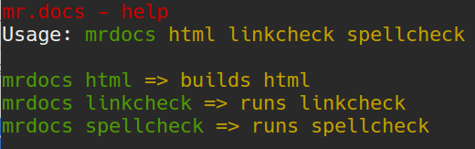

mr.docs
=======
About
-----

A container wrapper based on `Alpine Linux <http://www.alpinelinux.org/>`_ for `Sphinx <http://sphinx-doc.org/>`_ based `reStructuredText [rst] <http://sphinx-doc.org/rest.html>`_ written documentation.

The main propose behind mr.docs is to avoid the installation of `Sphinx <http://sphinx-doc.org/>`_ into all project directories to build and test documentation over and over again.

- install it once
- one configuration
- speed
- works with different Operating Systems
- not messing with system python and other dependencies
- 'smallish'

Dependencies
------------

- `Docker <https://docker.com>`_

If you do not have Docker installed yet, please follow the `official install guide <https://docs.docker.com/engine/installation/>`_.

Getting mr.docs
---------------

.. code-block:: bash

    $ docker pull quay.io/tiramisu/mr.docs

Assumptions
-----------

mr.docs assumes that the documentation you want to test is located in a directory called ``docs`` and that the documentation is written is ``.rst``.

Usage
-----
Every command which you typical run via your ``Makefile`` like *make html* within Sphinx you can run via mr.docs.

Example
~~~~~~~
Change into the main directory of your project you working on, for example the `Unified Installer <https://github.com/plone/Installers-UnifiedInstaller>`_ for `Plone <https://plone.org>`_.

.. code-block:: bash

    $ cd Projects/temp/Installers-UnifiedInstaller/

If you do now a ``ls``, you will see we have here a directory called *docs*, great !

If you want to build now the documentation as ``html``, just run:

.. code-block:: bash

    $ docker run -it --rm -v ${PWD}/docs:/build/docs:rw -u $(id -u):$(id -g) --name docs-tester quay.io/tiramisu/mr.docs html

Typically you do want to have this as an alias or function, to make it easy to remember, use for example the alias ``mrdocs`` so that you can execute:

.. code-block:: bash

    $ mrdocs html

This will build the documentation as html and will store int under *_build/html* of your *docs* directory.

If you would like to know more about how to use an alias or function, please read :doc:`the documentation about setup and configuration <setup>`.

.. toctree::
   :hidden:
   :maxdepth: 1

   setup
   builder
   update

