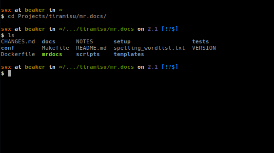
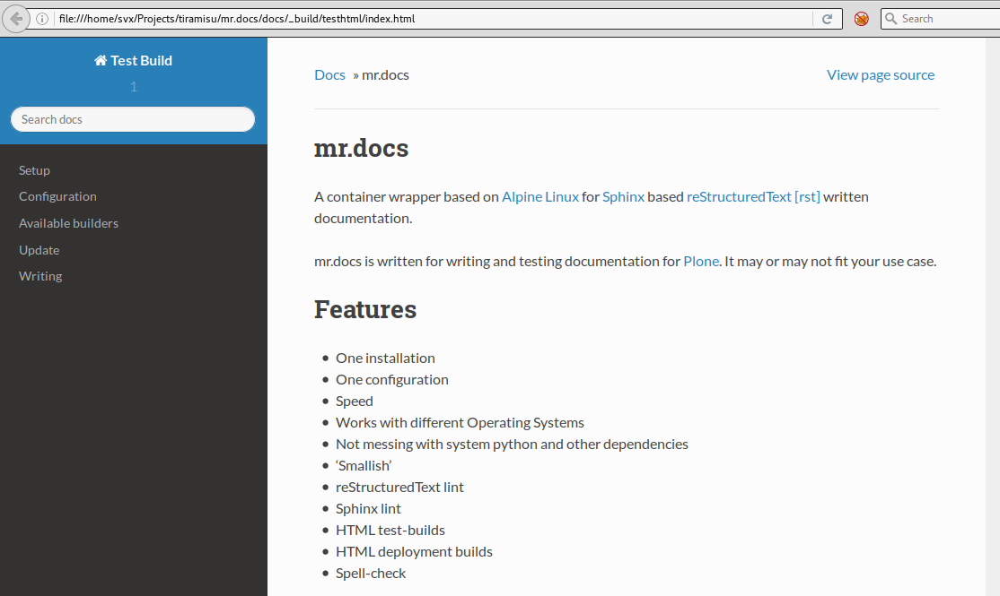
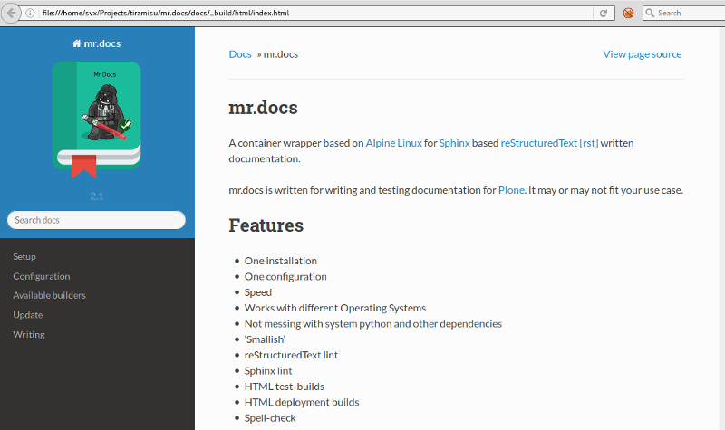

mr.docs
=======

A container wrapper based on `Alpine Linux <http://www.alpinelinux.org/>`_ for `Sphinx <http://sphinx-doc.org/>`_ based `reStructuredText [rst] <http://sphinx-doc.org/rest.html>`_ written documentation.

mr.docs is written for writing and testing documentation for `Plone <https://plone.org>`_. It may or may not fit your use case.

The main purpose of mr.docs is **testing**, this is what mr.docs is written for.
However you also can use mr.docs to build your documentation for *production*.

Features
========

- One installation
- One configuration
- Speed
- Works with different Operating Systems
- Not messing with system python and other dependencies
- 'Smallish'
- reStructuredText lint
- Sphinx lint
- HTML test-builds
- HTML deployment builds
- Spell-check

Dependencies
------------

- `Docker <https://docker.com>`_
- Bash

If you do not have Docker installed yet, please follow the `official install guide <https://docs.docker.com/engine/installation/>`_.

Getting mr.docs
---------------

.. code-block:: bash

  docker pull quay.io/tiramisu/mr.docs

Updating
~~~~~~~~

.. code-block:: bash

  docker pull quay.io/tiramisu/mr.docs

Assumptions
-----------

mr.docs assumes that the documentation you want to test is located in a directory called ``docs`` and that the documentation is written is ``.rst``.

Example
~~~~~~~
Change into the main directory of your project.

For this example the code repository of the `mr.docs <https://github.com/tiramisusolutions/mr.docs/tree/master>`_ is used.

.. code-block:: bash

  cd Projects/tiramisu/mr.docs/

If you do now a ``ls``, you will see we have here a directory called *docs*.

Running a test build:

.. raw:: html

  

Generated HTML

Running a deployment build:

.. raw:: html

  

Generated HTML

.. toctree::
   :hidden:
   :maxdepth: 1

   usage
   configuration
   changes

