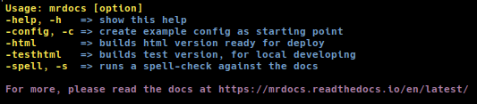

=====
Usage
=====

Commands
========

**Running A Test Build**

.. code-block:: bash

  docker run --rm -v "${PWD}/docs":/build/docs:rw -u "$(id -u)":"$(id -g)" quay.io/tiramisu/mr.docs testhtml

**Running Spell-Check**

.. code-block:: bash

  docker run --rm -v "${PWD}/docs":/build/docs:rw -u "$(id -u)":"$(id -g)" quay.io/tiramisu/mr.docs spellcheck

Read more about :doc:`spell-check <configuration>`.

**Using Configuration Template**

.. code-block:: bash

  docker run --rm -v "${PWD}/docs":/build/docs:rw -u "$(id -u)":"$(id -g)" quay.io/tiramisu/mr.docs config

Read more about a :doc:`custom base setup <configuration>`.

**Building For Deployment**

.. code-block:: bash

  docker run --rm -v "${PWD}/docs":/build/docs:rw -u "$(id -u)":"$(id -g)" quay.io/tiramisu/mr.docs html

Read more about a :doc:`deployment setup <configuration>`.

Using A Script
==============

.. note:: This is on your own risk, before you download and use it, please review it first! Never use scripts without review !!

To make the usage of mr.docs easier and faster, there is a bash script, which also adds certain logics such as directory and file checking.
**Use this on your own risk !**

You can find the script on `GitHub <https://github.com/tiramisusolutions/mr.docs/blob/master/mrdocs>`_.

.. code-block:: bash

    curl -o /usr/local/bin https://raw.githubusercontent.com/tiramisusolutions/mr.docs/master/mrdocs

This will download the script called *mr.docs* into */usr/local/bin*.

Feel free to adjust the download location according to your setup/needs.

Script Usage:

**Example**

Running a test build:

.. code-block:: bash

    mrdocs -testbuild
